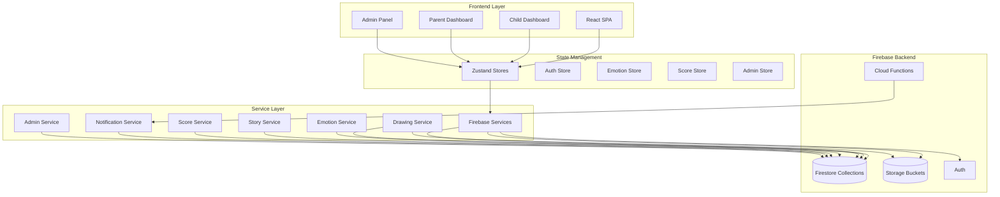
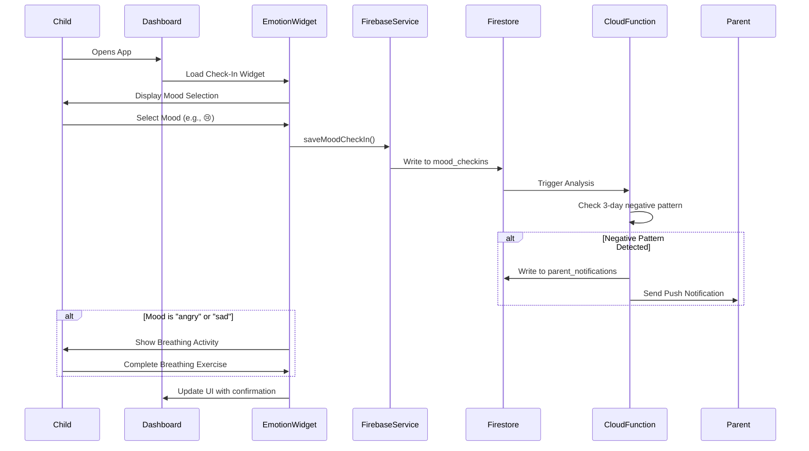
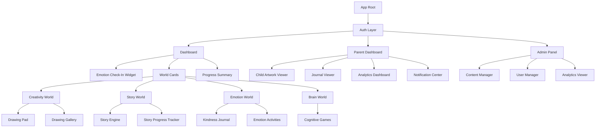

# Design Document: Advanced SpaceECE Features Implementation

## Overview

This design document outlines the implementation of advanced features for the SpaceECE educational platform, an early childhood development application built with React, TypeScript, and Firebase. The platform provides interactive learning experiences across multiple "worlds" (Brain, Creativity, Emotion, Story) with gamification elements.

The advanced features focus on emotional intelligence tracking, enhanced creative expression, complex narrative systems, dual scoring mechanisms (cognitive vs social-emotional), journaling capabilities, and comprehensive admin management tools. These additions transform SpaceECE from a basic educational platform into a comprehensive child development tracking system with parental oversight and data-driven insights.

The implementation leverages the existing architecture (React + TypeScript + Firebase + Zustand state management) and extends it with new Firebase collections, React components, services, and administrative interfaces. The design emphasizes child safety, parental involvement, and evidence-based early childhood development principles.

## Architecture

### System Overview



### Data Flow Architecture



### Component Hierarchy



## Components and Interfaces

### Component 1: Emotion Check-In Widget

**Purpose**: Daily emotional state tracking with intervention triggers for negative patterns

**Interface**:
```typescript
interface EmotionCheckInWidgetProps {
  userId: string;
  onComplete?: (mood: MoodType) => void;
}

interface EmotionCheckInWidget {
  displayMoodSelector(): void;
  saveMoodCheckIn(mood: MoodType, note?: string): Promise<void>;
  triggerBreathingActivity(): void;
  checkNegativePattern(): Promise<boolean>;
}
```

**Responsibilities**:
- Display interactive mood emoji selector
- Persist mood data to Firestore with timestamp
- Detect negative mood patterns (3+ consecutive days)
- Trigger breathing activity for "sad" or "angry" moods
- Send notifications to parents when patterns detected
- Display historical mood trend visualization

**State Management**:
```typescript
interface EmotionState {
  currentMood: MoodType | null;
  moodHistory: MoodCheckin[];
  isBreathingActivityActive: boolean;
  hasNegativePattern: boolean;
}
```

### Component 2: Drawing Pad

**Purpose**: Canvas-based drawing tool with Firebase Storage integration

**Interface**:
```typescript
interface DrawingPadProps {
  userId: string;
  mode: 'free-draw' | 'coloring';
  templateUrl?: string;
  onSave?: (drawingUrl: string) => void;
}

interface DrawingPad {
  initializeCanvas(): void;
  setDrawingTool(tool: DrawingTool): void;
  setColor(color: string): void;
  setBrushSize(size: number): void;
  undo(): void;
  redo(): void;
  clear(): void;
  saveDrawing(): Promise<DrawingData>;
  loadDrawing(drawingId: string): Promise<void>;
}

interface DrawingTool {
  type: 'pen' | 'brush' | 'eraser' | 'fill' | 'shape';
  options?: {
    shape?: 'circle' | 'rectangle' | 'triangle';
    pattern?: 'solid' | 'dashed';
  };
}
```

**Responsibilities**:
- Render HTML5 Canvas with drawing tools
- Implement undo/redo stack
- Handle touch and mouse input
- Convert canvas to Blob for upload
- Generate thumbnail for gallery view
- Upload to Firebase Storage with progress tracking
- Save metadata to Firestore

**Dependencies**: fabric.js for canvas manipulation

### Component 3: Story Engine

**Purpose**: Branching narrative system with choice-based progression

**Interface**:
```typescript
interface StoryEngineProps {
  storyId: string;
  userId: string;
  onEndingReached?: (endingId: string) => void;
}

interface StoryEngine {
  loadStory(storyId: string): Promise<Story>;
  getCurrentNode(): StoryNode;
  makeChoice(choiceId: string): void;
  getAvailableChoices(): StoryChoice[];
  checkEndingCondition(): StoryEnding | null;
  saveProgress(): Promise<void>;
  loadProgress(): Promise<StoryProgress>;
  getDiscoveredEndings(): string[];
  getAllPossibleEndings(): string[];
}

interface StoryNode {
  id: string;
  type: 'intro' | 'choice-point' | 'ending';
  content: StoryContent;
  choices?: StoryChoice[];
}

interface StoryChoice {
  id: string;
  text: string;
  targetNodeId: string;
  condition?: StoryCondition;
}

interface StoryCondition {
  type: 'visited-node' | 'ending-unlocked' | 'score-threshold';
  value: string | number;
}
```

**Responsibilities**:
- Parse story data structure from Firestore
- Manage current node state
- Evaluate choice conditions
- Track visited nodes for replay detection
- Persist progress to Firestore
- Calculate completion percentage
- Trigger ending achievements

**State Management**:
```typescript
interface StoryEngineState {
  currentStory: Story | null;
  currentNode: StoryNode | null;
  visitedNodes: string[];
  choiceHistory: string[];
  discoveredEndings: string[];
  isComplete: boolean;
}
```

### Component 4: Kindness Journal

**Purpose**: Weekly reflective journaling for social-emotional development

**Interface**:
```typescript
interface KindnessJournalProps {
  userId: string;
  week: number;
  year: number;
}

interface KindnessJournal {
  createEntry(type: 'text' | 'drawing'): void;
  saveTextEntry(text: string): Promise<void>;
  saveDrawingEntry(imageUrl: string): Promise<void>;
  getEntriesForWeek(week: number, year: number): Promise<JournalEntry[]>;
  getAllEntries(): Promise<JournalEntry[]>;
  shareWithParent(entryId: string): Promise<void>;
}

interface JournalEntry {
  id: string;
  userId: string;
  type: 'text' | 'drawing';
  content: string; // text or image URL
  week: number;
  year: number;
  createdAt: string;
  sharedWithParent: boolean;
}
```

**Responsibilities**:
- Provide text input and drawing interfaces
- Validate entry completeness
- Store entries in Firestore
- Display historical entries in chronological order
- Allow parent viewing access
- Track weekly completion streaks

### Component 5: Cognitive Score Tracker

**Purpose**: Separate tracking and analytics for cognitive performance

**Interface**:
```typescript
interface CognitiveScoreTrackerProps {
  userId: string;
  timeRange: 'week' | 'month' | 'year' | 'all';
}

interface CognitiveScoreTracker {
  recordScore(gameId: string, score: CognitiveScoreData): Promise<void>;
  getScoresByGame(gameId: string): Promise<CognitiveScoreData[]>;
  getScoresByTimeRange(range: TimeRange): Promise<CognitiveScoreData[]>;
  calculateAverageAccuracy(): number;
  calculateImprovementRate(): number;
  getWeakAreas(): GameCategory[];
  getStrengthAreas(): GameCategory[];
}

interface CognitiveScoreData {
  gameId: string;
  gameType: 'memory' | 'sequence' | 'pattern' | 'maze';
  score: number;
  accuracy: number;
  attempts: number;
  completionTime: number;
  difficulty: 'easy' | 'medium' | 'hard';
  timestamp: string;
}
```

**Responsibilities**:
- Persist cognitive game results to dedicated collection
- Calculate aggregate statistics
- Generate trend visualizations using recharts
- Identify learning gaps and strengths
- Provide data for parent dashboard

### Component 6: Emotion Score Tracker

**Purpose**: Separate tracking for social-emotional learning outcomes

**Interface**:
```typescript
interface EmotionScoreTrackerProps {
  userId: string;
  timeRange: 'week' | 'month' | 'year' | 'all';
}

interface EmotionScoreTracker {
  recordScore(activityId: string, score: EmotionScoreData): Promise<void>;
  getScoresByActivity(activityId: string): Promise<EmotionScoreData[]>;
  getScoresByEmotion(emotion: EmotionTag): Promise<EmotionScoreData[]>;
  calculateEmpathyScore(): number;
  calculateEmotionRegulationScore(): number;
  getEmotionTrends(): EmotionTrend[];
}

interface EmotionScoreData {
  activityId: string;
  activityType: 'recognition' | 'regulation' | 'empathy' | 'social-skills';
  score: number;
  emotionTag: EmotionTag;
  timestamp: string;
}

type EmotionTag = 'happy' | 'sad' | 'angry' | 'scared' | 'surprised' | 'disgusted' | 'neutral';

interface EmotionTrend {
  emotion: EmotionTag;
  frequency: number;
  averageScore: number;
  trend: 'improving' | 'stable' | 'declining';
}
```

**Responsibilities**:
- Store emotion-related activity results separately from cognitive scores
- Track emotion recognition accuracy
- Monitor empathy development
- Generate social-emotional reports
- Provide insights for parents and educators

### Component 7: Parent Dashboard

**Purpose**: Comprehensive parental monitoring and engagement interface

**Interface**:
```typescript
interface ParentDashboardProps {
  parentId: string;
  childId: string;
}

interface ParentDashboard {
  getChildProgress(childId: string): Promise<ChildProgressData>;
  getArtworkGallery(childId: string): Promise<Drawing[]>;
  getJournalEntries(childId: string): Promise<JournalEntry[]>;
  getNotifications(): Promise<ParentNotification[]>;
  markNotificationRead(notificationId: string): Promise<void>;
  getCognitiveAnalytics(): Promise<CognitiveAnalytics>;
  getEmotionAnalytics(): Promise<EmotionAnalytics>;
  getMoodHistory(): Promise<MoodCheckin[]>;
}

interface ChildProgressData {
  cognitiveScores: CognitiveScoreData[];
  emotionScores: EmotionScoreData[];
  overallProgress: number;
  worldProgress: {
    brain: number;
    creativity: number;
    emotion: number;
    story: number;
  };
  recentAchievements: Achievement[];
  streak: number;
}

interface ParentNotification {
  id: string;
  type: 'mood-alert' | 'achievement' | 'milestone' | 'inactivity';
  title: string;
  message: string;
  priority: 'low' | 'medium' | 'high';
  read: boolean;
  createdAt: string;
  actionUrl?: string;
}
```

**Responsibilities**:
- Display child's cognitive and emotional progress
- Show artwork gallery with masonry layout
- Present journal entries with privacy respect
- Alert parents to negative mood patterns
- Provide downloadable progress reports
- Enable parent-child interaction features

### Component 8: Admin Panel

**Purpose**: Content management and system administration

**Interface**:
```typescript
interface AdminPanelProps {
  adminId: string;
}

interface AdminPanel {
  // Content Management
  createCognitiveGame(game: CognitiveGameData): Promise<string>;
  updateCognitiveGame(gameId: string, updates: Partial<CognitiveGameData>): Promise<void>;
  deleteCognitiveGame(gameId: string): Promise<void>;
  
  createColoringTemplate(template: ColoringTemplateData): Promise<string>;
  uploadStoryAssets(storyId: string, assets: File[]): Promise<string[]>;
  
  createEmotionScenario(scenario: EmotionScenarioData): Promise<string>;
  updateEmotionScenario(scenarioId: string, updates: Partial<EmotionScenarioData>): Promise<void>;
  
  createBranchingStory(story: BranchingStoryData): Promise<string>;
  updateStory(storyId: string, updates: Partial<BranchingStoryData>): Promise<void>;
  
  // User Management
  getUserList(filters: UserFilters): Promise<UserData[]>;
  getUserDetails(userId: string): Promise<UserDetails>;
  updateUserRole(userId: string, role: UserRole): Promise<void>;
  deactivateUser(userId: string): Promise<void>;
  
  // Analytics
  getSystemAnalytics(): Promise<SystemAnalytics>;
  getUserAnalytics(userId: string): Promise<UserAnalytics>;
  exportAnalytics(format: 'csv' | 'json' | 'pdf'): Promise<Blob>;
}

interface CognitiveGameData {
  type: 'memory' | 'sequence' | 'pattern' | 'maze';
  ageGroup: '3-4' | '4-5' | '5-6';
  difficulty: 'easy' | 'medium' | 'hard';
  contentData: Record<string, any>;
  instructions: string;
  timeLimit?: number;
}

interface EmotionScenarioData {
  scenarioText: string;
  scenarioImage?: string;
  choices: {
    text: string;
    isCorrect: boolean;
    feedback: string;
  }[];
  emotionTag: EmotionTag;
  learningObjective: string;
}

interface BranchingStoryData {
  title: string;
  introduction: string;
  nodes: StoryNode[];
  endings: StoryEnding[];
  ageGroup: string;
  themes: string[];
}
```

**Responsibilities**:
- CRUD operations for all content types
- File upload management for images and assets
- User role and permissions management
- System-wide analytics and reporting
- Content moderation and approval workflows
- Database maintenance operations

### Component 9: Breathing Activity

**Purpose**: Guided breathing exercise for emotional regulation

**Interface**:
```typescript
interface BreathingActivityProps {
  onComplete?: () => void;
  duration?: number; // seconds
}

interface BreathingActivity {
  start(): void;
  pause(): void;
  resume(): void;
  stop(): void;
  getCurrentPhase(): BreathingPhase;
  getProgress(): number;
}

interface BreathingPhase {
  type: 'inhale' | 'hold' | 'exhale';
  duration: number;
  instruction: string;
  animation: string;
}
```

**Responsibilities**:
- Display animated breathing guide (expanding/contracting circle)
- Provide audio cues for inhale/hold/exhale phases
- Track completion for analytics
- Calming visual design with soothing colors
- Age-appropriate duration (2-3 minutes)

### Component 10: Drawing Gallery

**Purpose**: Masonry layout gallery for viewing saved artwork

**Interface**:
```typescript
interface DrawingGalleryProps {
  userId: string;
  viewMode: 'grid' | 'masonry';
  filterBy?: 'free-draw' | 'coloring' | 'story' | 'all';
}

interface DrawingGallery {
  loadDrawings(): Promise<Drawing[]>;
  filterDrawings(filter: DrawingFilter): Drawing[];
  sortDrawings(sortBy: 'date' | 'type'): Drawing[];
  deleteDrawing(drawingId: string): Promise<void>;
  shareDrawing(drawingId: string, recipient: string): Promise<void>;
  downloadDrawing(drawingId: string): Promise<Blob>;
}

interface DrawingFilter {
  type?: 'free-draw' | 'coloring' | 'story';
  dateFrom?: string;
  dateTo?: string;
}
```

**Responsibilities**:
- Fetch drawings from Firestore with pagination
- Display thumbnails in responsive masonry layout
- Implement lightbox for full-size viewing
- Provide delete confirmation dialog
- Enable sharing with parents
- Support download for offline viewing

**Dependencies**: react-masonry-css for layout

## Data Models

### Model 1: MoodCheckin

```typescript
interface MoodCheckin {
  id: string;
  userId: string;
  mood: MoodType;
  moodValue: number; // 1-7 numeric scale
  timestamp: string; // ISO 8601
  date: string; // YYYY-MM-DD for querying
  note?: string;
  triggerredBreathingActivity: boolean;
}

type MoodType = 'very-happy' | 'happy' | 'okay' | 'neutral' | 'sad' | 'very-sad' | 'angry';

// Mood value mapping:
// very-happy: 7
// happy: 6
// okay: 5
// neutral: 4
// sad: 3
// very-sad: 2
// angry: 1
```

**Validation Rules**:
- `userId` must be valid Firebase UID
- `mood` must be one of the defined MoodType values
- `moodValue` must be integer between 1 and 7
- `timestamp` must be valid ISO 8601 format
- `date` must be YYYY-MM-DD format
- Maximum one check-in per user per day

**Firestore Indexes**:
- Composite index on `userId` + `date` (descending)
- Composite index on `userId` + `timestamp` (descending)

### Model 2: Drawing

```typescript
interface Drawing {
  id: string;
  userId: string;
  type: 'free-draw' | 'coloring' | 'story';
  imageUrl: string; // Firebase Storage path
  thumbnailUrl: string; // Firebase Storage path
  templateId?: string; // for coloring pages
  createdAt: string;
  updatedAt: string;
  metadata: {
    width: number;
    height: number;
    fileSize: number;
    mimeType: string;
  };
  sharedWith: string[]; // parent IDs
  tags?: string[];
}
```

**Validation Rules**:
- `userId` must be valid Firebase UID
- `type` must be one of 'free-draw', 'coloring', 'story'
- `imageUrl` and `thumbnailUrl` must be valid Firebase Storage URLs
- `metadata.width` and `metadata.height` must be positive integers
- `metadata.fileSize` must not exceed 10MB
- `metadata.mimeType` must be 'image/png' or 'image/jpeg'

### Model 3: StoryProgress

```typescript
interface StoryProgress {
  id: string;
  userId: string;
  storyId: string;
  currentNodeId: string;
  visitedNodes: string[];
  choiceHistory: StoryChoice[];
  endingsUnlocked: string[];
  completionPercentage: number;
  startedAt: string;
  lastPlayedAt: string;
  completedAt?: string;
  totalPlaytime: number; // seconds
}

interface StoryChoice {
  nodeId: string;
  choiceId: string;
  timestamp: string;
}
```

**Validation Rules**:
- `userId` and `storyId` must be valid references
- `currentNodeId` must exist in story's nodes array
- `visitedNodes` must be subset of story's node IDs
- `completionPercentage` must be between 0 and 100
- `totalPlaytime` must be non-negative integer
- Unique constraint on `userId` + `storyId`

### Model 4: KindnessJournalEntry

```typescript
interface KindnessJournalEntry {
  id: string;
  userId: string;
  entryType: 'text' | 'drawing';
  content: string; // text content or image URL
  week: number; // ISO week number
  year: number;
  weekStartDate: string; // YYYY-MM-DD
  createdAt: string;
  viewedByParent: boolean;
  parentComments?: ParentComment[];
}

interface ParentComment {
  parentId: string;
  comment: string;
  timestamp: string;
}
```

**Validation Rules**:
- `userId` must be valid Firebase UID
- `entryType` must be 'text' or 'drawing'
- For text entries: `content` length must be 10-500 characters
- For drawing entries: `content` must be valid Firebase Storage URL
- `week` must be 1-53
- `year` must be 2020 or later
- Unique constraint on `userId` + `week` + `year`

### Model 5: CognitiveScore

```typescript
interface CognitiveScore {
  id: string;
  userId: string;
  gameId: string;
  gameType: 'memory' | 'sequence' | 'pattern' | 'maze';
  score: number;
  accuracy: number; // percentage 0-100
  attempts: number;
  completionTime: number; // seconds
  difficulty: 'easy' | 'medium' | 'hard';
  timestamp: string;
  metadata: {
    level: number;
    mistakes: number;
    hints